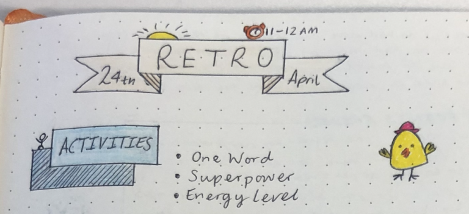
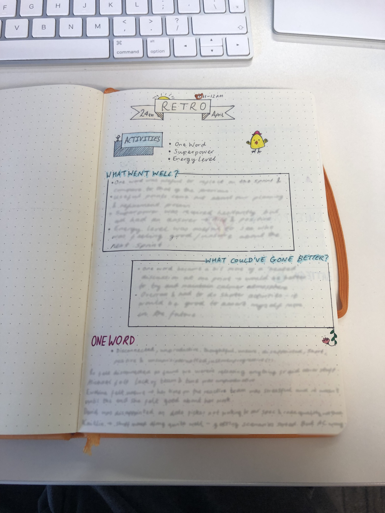
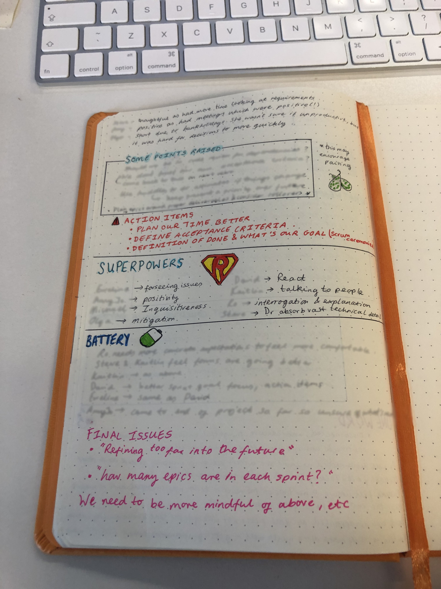

All workplaces can have their highs and lows. I feel like I’m charged by positivity. Lack of it tends to leave me feeling drained- I suppose JK Rowling’s Dementors make for a good metaphor here. In fact, I feel like everyone has this feeling, but somehow get stuck in a vicious cycle.

For the past two sprints I have hosted the retrospective in place of our usual Scrum Master, after raising a query about injecting a little more positivity into them. I have been really happy to do the hosting – initially I wondered if it would be quite weird, given I’m at the bottom of the pack, or so to speak!

I’m pretty good at listening and suggesting, which is something I brought to my hosting of these. However, the environment here is quite different to those I have experienced before. At the moment I’m a P1 Junior Level Engineer, working on a team of all different levels of experience, so it’s a little bit different than perhaps discussing with your cohort who have mainly had the same kinds of exposure to the matter at hand. Fortunately, my team are great and create a pleasant atmosphere, so I don’t worry much about saying something ‘dumb’.

There’s some really good retro resources out there – [Fun Retrospectives](http://www.funretrospectives.com/) definitely has a great bunch of all different kinds. The first time hosting, I used this site solely, but the second time I had a little more of a poke around different blog posts to gather some different perspectives.

Overall I found the ‘One Word’ exercise from [Fun Retrospectives](http://www.funretrospectives.com/one-word/), where each team member comes up with a word to be a great resource to find pain points. Further to this, coming back to the same exercise in the next retro allowed us to see the change over two weeks, as well as any correlation.

‘Your Superpower’ [from this blog post](https://agilestrides.com/blog/40-ideas-to-spice-up-your-retrospective/), where team members use sticky notes to put up the superpower they bring to the team, was a great source of positive energy. I found it was received hesitantly at first, but everyone came up with a really nice, positive answer.

‘Energy Level’ again from [this blog post](https://agilestrides.com/blog/40-ideas-to-spice-up-your-retrospective/), allowed team members to stick their name on a picture of a battery to visually show their energy level for the next sprint. Seeing the spread of energy levels was useful to pick out what the ‘excitement’ and the ‘hesitance’ was with beginning the new sprint.

I find it super helpful to write everything down, even if it’s just scribbled notes. Every idea/pain point/good thing, I write down as quick as I can. This time I decided to write them up neatly in my work journal, before putting a document together for the team to see. It really helped me to reflect, and pull out further action items, as well as identify things that we’ve been doing (good or bad!).

I’ve put a couple images of my journal below in case anyone is interested!

-Amy Jo

[See where I started out my blog](https://amyjorumi.home.blog/).

